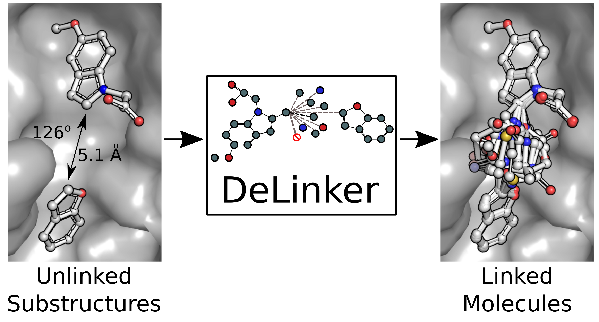

# DeLinker - Deep Generative Models for 3D Compound Design



This repository contains our implementation of [Deep Generative Models for 3D Compound Design](https://www.biorxiv.org/content/10.1101/830497v1) (DeLinker). 

If you found DeLinker useful, please cite our preprint:

```
@article{Imrie2019DeLinker,
  title = {Deep Generative Models for 3D Compound Design},
  author = {Imrie, Fergus and Bradley, Anthony R and van der Schaar, Mihaela and Deane, Charlotte M},
  journal = {bioRxiv},
  doi = {10.1101/830497},
  year = {2019},
  URL = {https://www.biorxiv.org/content/early/2019/11/04/830497},
  eprint = {https://www.biorxiv.org/content/early/2019/11/04/830497.full.pdf}
}
```

# Requirements

This code was tested in Python 3.6 with Tensorflow 1.10. 

A yaml file containing all requirements is provided. This can be readily setup using conda.

```
conda env create -f DeLinker-env.yml
conda activate DeLinker-env
```

# Data Extraction

Two primary datasets (ZINC and CASF) are in use.

To preprocess these datasets, please go to `data` directory and run `prepare_data.py`.

```
python prepare_data.py
```

# Running DeLinker

We provide two settings of DeLinker. The first setting generates linkers with the same number of atoms as the reference molecule. The second setting generates linkers with a specified number of atoms. 

To train and generate molecules using the first setting, use:

```
python DeLinker.py --dataset zinc --config '{"num_epochs": 10, "epoch_to_generate": 10, "train_file": "data/molecules_zinc_train.json", "valid_file": "data/molecules_zinc_valid.json"}'
```

To generate molecules with a pretrained model using the first setting, use

```
python DeLinker.py --dataset zinc --restore models/pretrained_DeLinker_model.pickle --config '{"generation": true, "number_of_generation_per_valid": 250, "batch_size": 1, "train_file": "data/molecules_zinc_test.json", "valid_file": "data/molecules_zinc_test.json"}'
```

To generate molecules using the second setting, use

```
python DeLinker_test.py --dataset zinc --restore models/pretrained_DeLinker_model.pickle --config '{"generation": true, "number_of_generation_per_valid": 250, "batch_size": 1, "train_file": "data/molecules_zinc_test.json", "valid_file": "data/molecules_zinc_test.json"}'
```

In both cases, the output is of the following format:

```
Input fragments (SMILES) Ground truth molecule/fragments (SMILES) Generated molecule (SMILES)
```

More configurations can be found at function `default_params` in `DeLinker.py`.

# Evaluation

A script to evaluate the generated molecules is provided in `analysis` directory

```
python evaluate_generated_mols.py ZINC|CASF PATH_TO_GENERATED_MOLS PATH_TO_REFERENCE_MOLS ../data/data_zinc_final_train.txt SAVE_PATH OUTPUT_NAME NUM_CORES True None ./wehi_pains.csv >> log.txt
```

# Pretrained Models and Generated Molecules

We provide a pretrained model:

```
models/pretrained_DeLinker_model.pickle
```

Generated molecules can be obtained upon request.

# Contact (Questions/Bugs/Requests)

Please submit a Github issue or contact Fergus Imrie [imrie@stats.ox.ac.uk](mailto:imrie@stats.ox.ac.uk).
